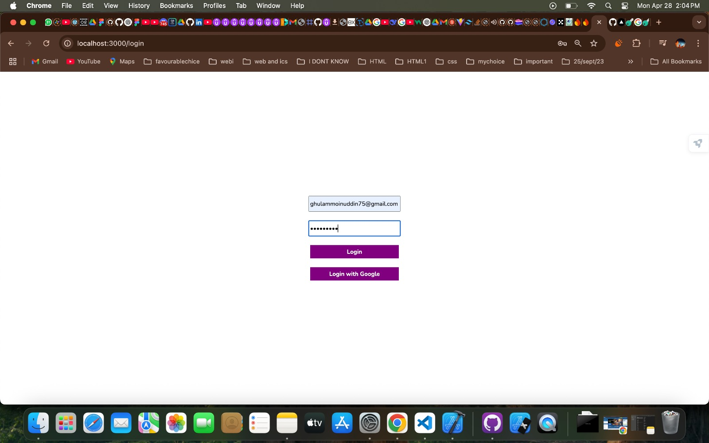
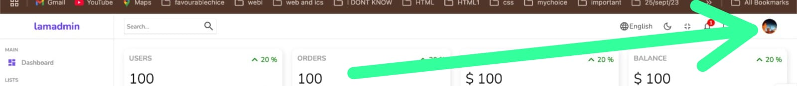
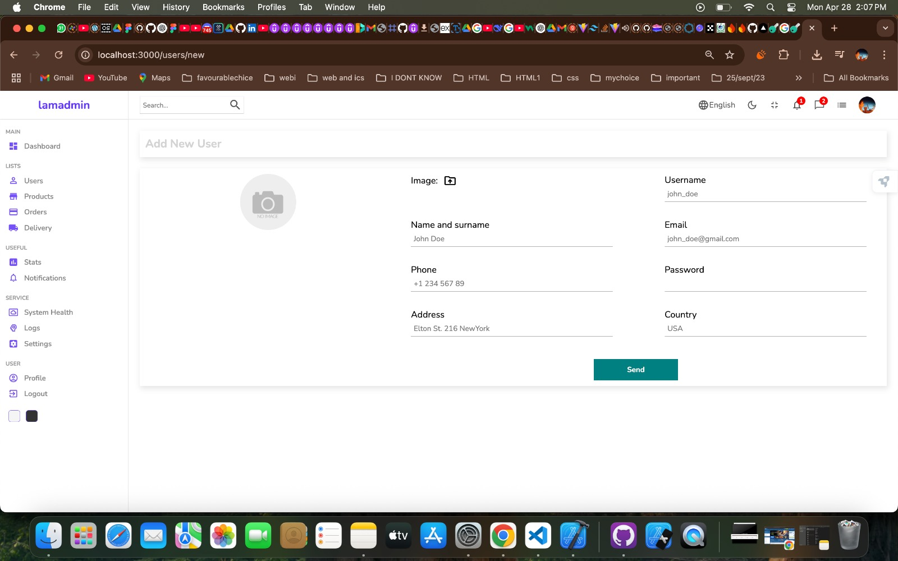
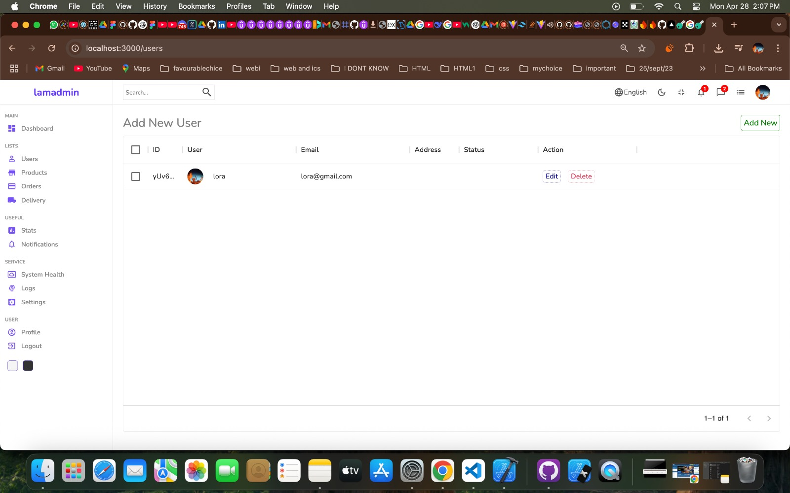
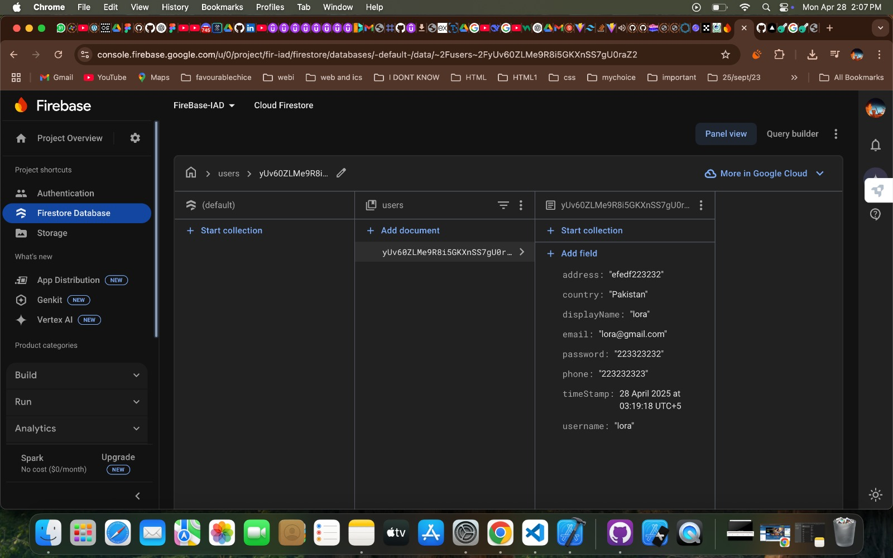
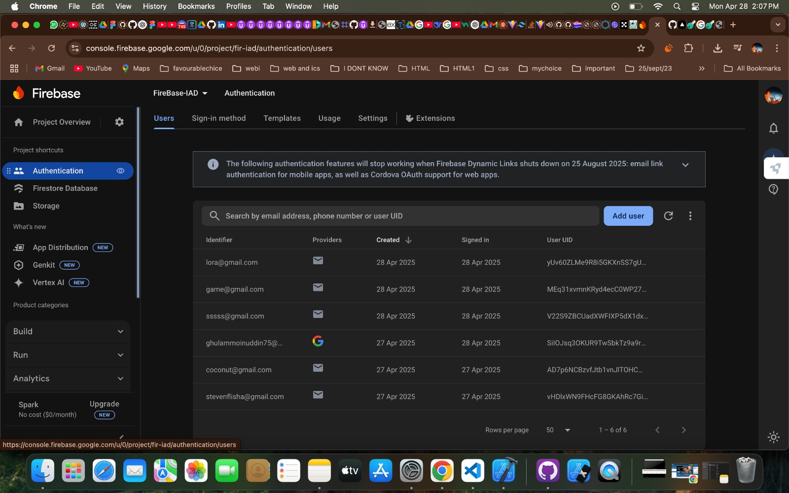

# FireBase-IAD

This is a React-based admin dashboard application **Firebase CRUD operations**, **Profile Picture Extraction**, and **Context API** to manage user data efficiently. 


FireBase-IAD is a React-based admin dashboard application that integrates Firebase for authentication and Firestore for data management. It provides a user-friendly interface for managing users, products, and transactions, with features like dark mode, charts, and real-time updates.


## Features

- **Authentication**: Login with email/password or Google authentication.
- **User Management**: Add, edit, and delete users with real-time updates from Firestore.
- **Product Management**: Manage product details and inventory.
- **Dashboard Widgets**: Display key metrics like users, orders, earnings, and balance.
- **Charts**: Visualize data trends with charts (e.g., revenue over the last 6 months).
- **Dark Mode**: Toggle between light and dark themes.
- **Responsive Design**: Fully responsive UI for desktop and mobile devices.

## Tech Stack

- **Frontend**: React, React Router, Material-UI, Recharts, SCSS
- **Backend**: Firebase Authentication, Firestore Database
- **State Management**: React Context API with Reducers

## Installation

1. Clone the repository:
   ```bash
   git clone https://github.com/MoinUddin-dev-dot/FireBase-IAD.git
   cd FireBase-IAD
   npm i 
   npm start
   ```

## .env API key
```
FIREBASE_API_KEY=your_firebase_api_key
```
## 🔄 Web App Flow

### 1. Login

Open the application in your browser:
   - Start the app you will Navigate to [http://localhost:3000/login](http://localhost:3000/login) to access the login page.
   - Sign in using **email and password** or via **Google authentication**.
   - After successful sign-in, you will be authenticated and registered in **Firebase Authentication**.

### 2. Profile Picture

   - Upon successful login, you will see your **profile picture** on the top-right corner. This picture is fetched using Google OAuth provider's profile data.
   
   - If you have upgraded your Firebase storage to premium, you can upload your own profile picture through the form. Otherwise, the app will show your signed-in Google OAuth profile picture.

### 3. User Management

   - Navigate to [http://localhost:3000/users](http://localhost:3000/users) to view all available users in the system. 
   - If there are no users, you can add new users by visiting [http://localhost:3000/users/new](http://localhost:3000/users/new).
   - The app allows for easy user addition, and newly added users will be displayed in a table.


## 📸 Screenshots


*Login Page*


*Dashboard*


*User Form Page*


*User table Page*


*User Firestore Table*


*User Auth Table*

## UI Clone

The UI has been cloned from [youtube2022 Project](https://github.com/safak/youtube2022.git).